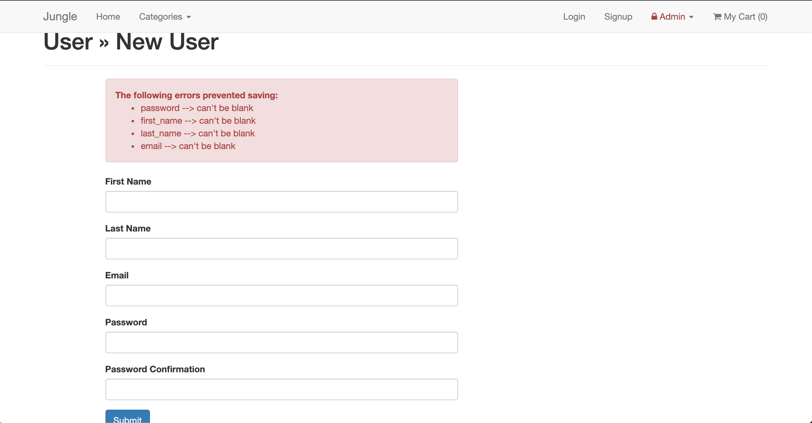
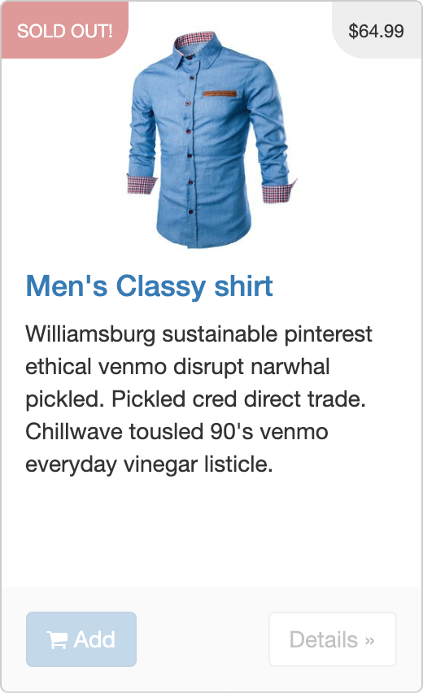
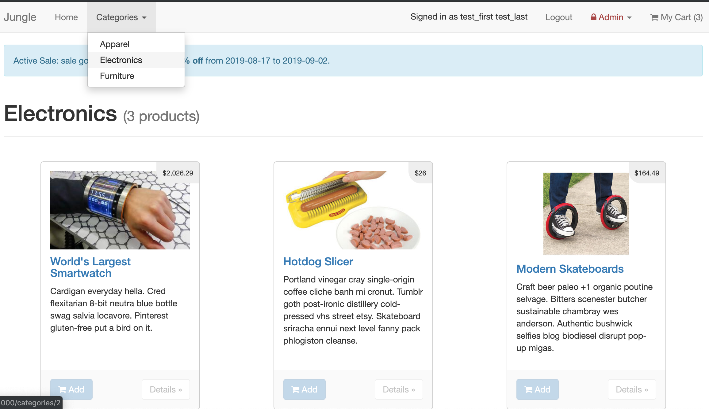
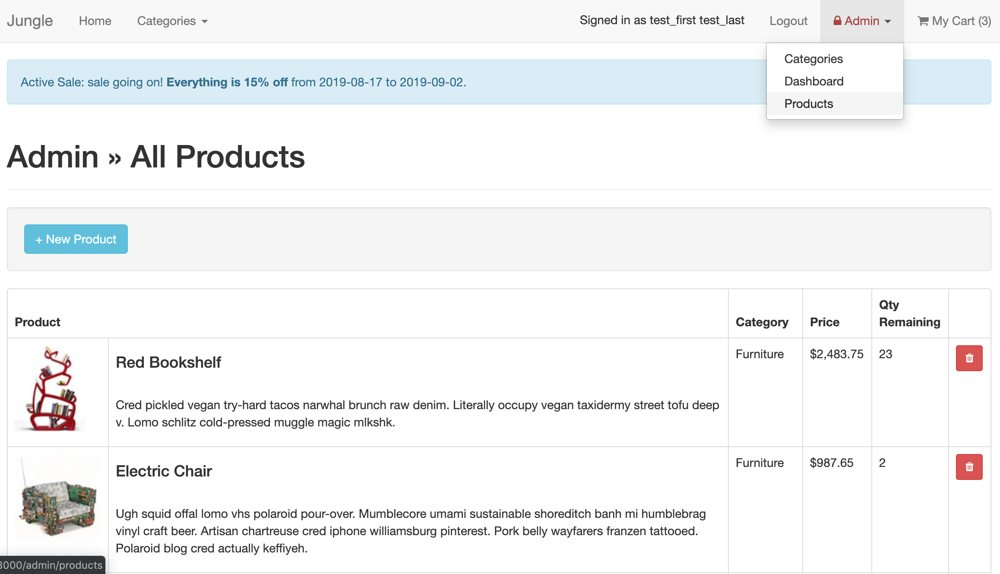

# Jungle Project

Jungle Project is build on Ruby on Rails.
This project is not just about learning a new language, ecosystem and framework. It's more so a simulation of the real world where you inherit an existing code base in a language / framework that you are not comfortable with.

---

## Dependencies

- Rails 4.2 [Rails Guide](http://guides.rubyonrails.org/v4.2/)
- PostgreSQL 9.x
- Stripe

---

## Testing Gems

- Capybara
- RSpec
- Poltergeist
- Database Cleaner

---

## Final Product

`home page`

`sign up authentication`

`user logged in - updated nav bar`

`sold out item flag`

`shopping cart view`

`filter by categories`

`admin dashboard - dropdown showing other capabilities`

